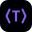
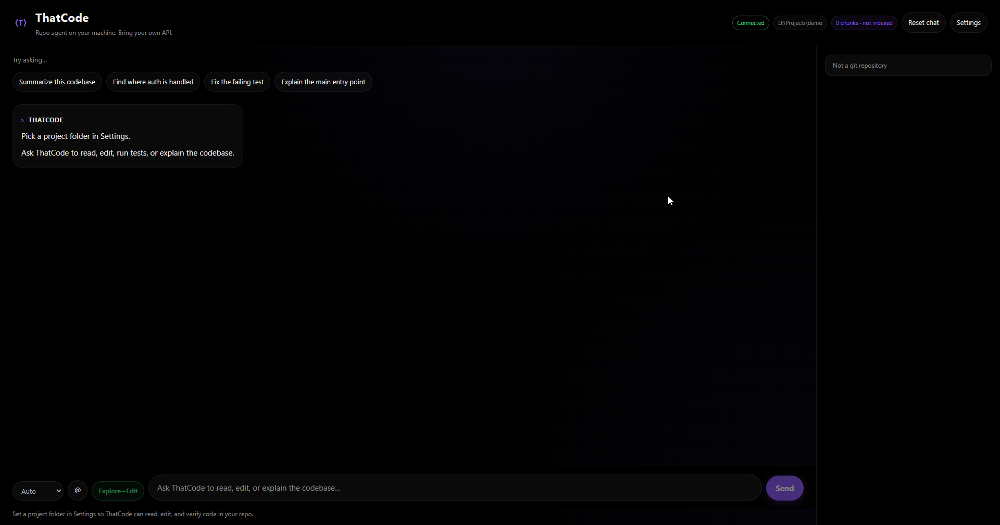
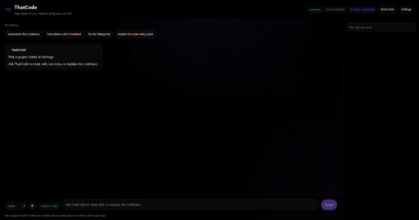
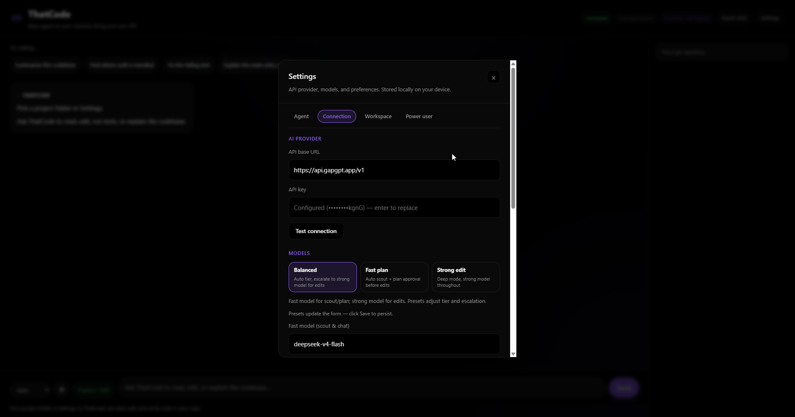
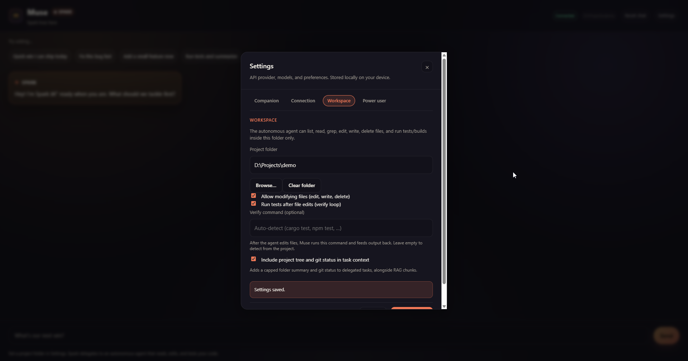

<p align="center">
  
</p>

<h1 align="center">ThatCode</h1>

<p align="center"><em>Repo agent on your machine. Bring your own API.</em></p>

<p align="center">
  <a href="https://github.com/Satan2049/that-code/actions/workflows/ci.yml"></a>
  <a href="https://github.com/Satan2049/that-code/releases/latest"></a>
  <a href="./LICENSE"></a>
</p>

<p align="center">
  <a href="https://github.com/Satan2049/ThatGPT">ThatGPT</a> family ·
  <a href="https://github.com/Satan2049/that-code/releases/latest">Download (Windows)</a> ·
  <a href="./docs/TRUST.md">Verify downloads</a> ·
  <a href="./SECURITY.md">Security</a>
</p>

---

**ThatCode** is a local coding agent with a simple desktop UI. Point it at a project folder, bring your own OpenAI-compatible API, and ask it to read, edit, run tests, and explain your codebase.

Sibling to **[ThatGPT](https://github.com/Satan2049/ThatGPT)** (ChatGPT, but local) — same tone, **separate product**.

> **Formerly Muse (v1–2).** **v2.7.1** is the current ThatCode release (Windows). See [CHANGELOG.md](./CHANGELOG.md) and [docs/temp/thatcode-todo.md](./docs/temp/thatcode-todo.md) for Phase 8–9 plans.

**Platform v1:** Windows (NSIS + MSI + portable zip). macOS and Linux are Phase 8.

---

## Features

- **Local-first** — SQLite history and settings on your device
- **Workspace agent** — sandboxed tools: read, edit, search, git, verify
- **Change review** — unified diffs with revert per file or revert all
- **Verify loop** — auto-run tests/build after edits (configurable)
- **OpenAI-compatible API** — any provider; your keys stay local
- **Optional** — MCP tools, RAG index, task queue (Settings)

- **Command palette** — `Ctrl+K` for settings, tiers, re-index, and more

*Current release:* **[v2.7.1](https://github.com/Satan2049/that-code/releases/tag/v2.7.1)** — verify with [`SHA256.txt`](./SHA256.txt) and [docs/TRUST.md](./docs/TRUST.md) (includes [VirusTotal](https://www.virustotal.com) reports for Windows installers).

---

## Screenshots

<p align="center">
  
</p>

<p align="center">
  
</p>

<p align="center">
  
  &nbsp;
  
</p>

---

## Installation (Windows)

1. Download **NSIS** (`.exe`), **MSI**, or **portable zip** from **[GitHub Releases](https://github.com/Satan2049/that-code/releases/latest)** — trusted source only.
2. Verify with **`SHA256.txt`** on the release page (see [checksums](./SHA256.txt) for v2.7.1):

   | Asset | SHA256 |
   |-------|--------|
   | `ThatCode_2.7.1_x64-setup.exe` | `26754bc38d74085603d7ab2799c9c1336a19e1cae5936d6f926e045cf14be4ed` |
   | `ThatCode_2.7.1_x64_en-US.msi` | `62881009afcfe2e1b1ac661117999b5a684b2e0eb653db61dda6fbc0bfdc65dd` |
   | `ThatCode_2.7.1_x64-portable.zip` | `499f0c9b29199420424021cf2569258fdd965bb15624ac1413773335a2d791fb` |

3. Optional: review [VirusTotal reports](./docs/TRUST.md#v271-scans-maintainer-submitted) (unsigned builds may show 1–2 heuristic flags).
4. Open Settings → set API URL/key → pick a project folder → start asking.

Upgrading from Muse 2.x requires a **clean install** (`com.thatcode.app` is a new app id).

---

## Development

**Windows** recommended for v1 work (release target).

```bash
git clone https://github.com/Satan2049/that-code.git
cd that-code
npm ci
npm run tauri dev
```

See **[docs/development.md](./docs/development.md)**.

```bash
npm run build
npm run test:rust
npm run lint:rust
```

---

## Build (Windows)

```bash
npm run tauri build
```

Output: `src-tauri/target/release/bundle/` (NSIS + MSI). Attach portable zip manually if needed for release.

```powershell
.\scripts\generate-sha256.ps1
# Compare with SHA256.txt in repo root before tagging v2.7.1
```

---

## Documentation

| Document | Purpose |
|----------|---------|
| [ARCHITECTURE.md](./ARCHITECTURE.md) | System design and request flow |
| [docs/development.md](./docs/development.md) | Clone, build, test |
| [docs/temp/thatcode-todo.md](./docs/temp/thatcode-todo.md) | Phase checklist |
| [docs/TRUST.md](./docs/TRUST.md) | Verify downloads |
| [CONTRIBUTING.md](./CONTRIBUTING.md) | Contributor guide |

---

## Contributing

See **[CONTRIBUTING.md](./CONTRIBUTING.md)** and **[CODE_OF_CONDUCT.md](./CODE_OF_CONDUCT.md)**.

---

## License

[MIT](./LICENSE) — Copyright (c) 2026 ThatCode Contributors
